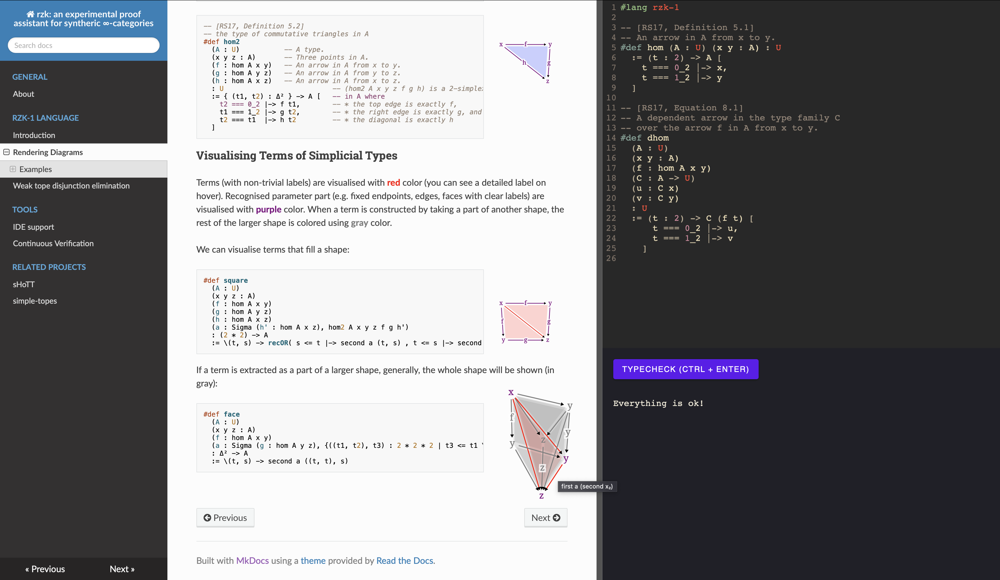

# rzk

[](https://rzk-lang.github.io/rzk/)
[](https://rzk-lang.github.io/rzk/haddock/index.html)
[](https://github.com/rzk-lang/rzk/actions/workflows/ghcjs.yml)

An experimental proof assistant for synthetic ∞-categories.

[](https://rzk-lang.github.io/rzk/)

## About this project

This project has started with the idea of bringing Riehl and Shulman's 2017 paper [1] to "life" by implementing a proof assistant based on their type theory with shapes. Currently an early prototype with an [online playground](https://rzk-lang.github.io/rzk/) is available. The current implementation is capable of checking various formalisations. Perhaps, the largest formalisations are available in two related projects: <https://github.com/fizruk/sHoTT> and <https://github.com/emilyriehl/yoneda>. `sHoTT` project (originally a fork of the yoneda project) aims to cover more formalisations in simplicial HoTT and ∞-categories, while `yoneda` project aims to compare different formalisations of the Yoneda lemma.

Internally, `rzk` uses a version of second-order abstract syntax allowing relatively straightforward handling of binders (such as lambda abstraction). In the future, `rzk` aims to support dependent type inference relying on E-unification for second-order abstract syntax [2].
Using such representation is motivated by automatic handling of binders and easily automated boilerplate code. The idea is that this should keep the implementation of `rzk` relatively small and less error-prone than some of the existing approaches to implementation of dependent type checkers.

An important part of `rzk` is a tope layer solver, which is essentially a theorem prover for a part of the type theory. A related project, dedicated just to that part is available at <https://github.com/fizruk/simple-topes>. `simple-topes` supports used-defined cubes, topes, and tope layer axioms. Once stable, `simple-topes` will be merged into `rzk`, expanding the proof assistant to the type theory with shapes, allowing formalisations for (variants of) cubical, globular, and other geometric versions of HoTT.

## How to use `rzk`

For relatively small single-file formalisations, you can use the online playground at <https://rzk-lang.github.io/rzk/playground.html>

However, for larger and multi-file formalisations you should install a version of `rzk` locally:

- You can install the latest "stable" version of `rzk` from Hackage:

  ```sh
  cabal install rzk
  ```
  
- You can install the latest "development" version of `rzk` from the [`develop` branch](https://github.com/rzk-lang/rzk/tree/develop) of this repository:

  ```sh
  git clone https://github.com/rzk-lang/rzk.git
  cd rzk
  git checkout develop
  stack build && stack install
  ```
  
### VS Code

There exists a [VS Code extension for `rzk`](https://marketplace.visualstudio.com/items?itemName=NikolaiKudasovfizruk.rzk-1-experimental-highlighting) available on the Marketplace. The extension supports basic syntax highlighting, but more features may come in the future.

### Checking

To check a multi-file project, you need to call `rzk typecheck` specifying the files _in correct order_, e.g.:

```sh
rzk typecheck first.rzk second.rzk third.rzk
```

A proper support for inter-file dependencies will be implemented in the future. Until then, it is recommented to start names of files with a number, ensuring correct order when using a wildcard (`*`). For example:

```console
.
├── 0-common.md
├── 1-paths.md
├── 2-contractible.md
├── 3-homotopies.md
├── 4-equivalences.md
├── 5-sigma.md
└── 6-trivial-fibrations.md

1 directory, 7 files
```

Inside of such directory, you can run `rzk typecheck` on all files using wildcards:

```sh
rzk typecheck *-*.md
```

## How to contribute to `rzk`

### Building the Documentation Locally

First, you need to install [MkDocs](https://www.mkdocs.org/getting-started/) and `mdx_math` Markdown extension (to enable LaTeX):

```sh
pip install python-markdown-math
```

Now, you can build and serve the documentation locally by running

```sh
mkdocs serve --config-file docs/mkdocs.yml
```

The (locally built) documentation should be available at <http://127.0.0.1:8000>

The pages of the documentation are the `*.md` files in [docs/docs](docs/docs) directory and its subdirectories.
To add a new page, you can create a new `*.md` file and add it to the navigation by modifying [docs/mkdocs.yml](docs/mkdocs.yml).

## Development

The project is developed with both [stack](https://docs.haskellstack.org/en/stable/README/) and [nix](https://nixos.org/manual/nix/unstable/introduction).

## Develop `rzk` with stack

For quick local development and testing it is recommended to work with a GHC version, using the `stack` tool. Clone this project and run `stack build`:

```sh
git clone https://github.com/rzk-lang/rzk.git
cd rzk
stack build
```

The build provides an executable `rzk` which can be used to typecheck files:

```haskell
stack exec -- rzk typecheck FILE
```

## Develop with `nix`

1. Install `nix`:

   ```console
   sh <(curl -L https://nixos.org/nix/install) --no-daemon
   ```

2. (Optionally) Permanently [enable nix flakes](https://nixos.wiki/wiki/Flakes#Permanent) to use faster and more convenient experimental (but quite stable) commands.
3. Use `cachix` to avoid building multiple dependencies:
   1. Without flakes: `nix-shell -p cachix --command 'cachix use miso-haskell'`
   2. With flakes: `nix shell nixpkgs#cachix -c cachix use miso-haskell`
4. (Optionally) Install [direnv](https://direnv.net/#basic-installation) to start the `devShell` when you enter the repository directory.
   1. The `nix-direnv` repo shows [installation options](https://github.com/nix-community/nix-direnv#installation).
5. (Optionally) If you use VS Code, you can install `mkhl.direnv` extension that loads `direnv` environments.

6. Clone this repository and enter it

    ```console
    git clone git@github.com:rzk-lang/rzk.git
    cd rzk
    ```

7. Run `direnv allow` in the repository root.
8. Use `cabal` for development.
   - `cabal` performs incremental builds meaning it will build only the parts that are changed. This is quite fast.
   - `nix` will rebuild the package `A` when its dependency `B` changes. Moreover, `nix` will rebuild all packages that are dependencies of `A` and that depend on `B`. This is much slower than incremental builds.
   - So, use `nix` for setting up the environment with necessary tools that don't need rebuilds.
9. The following sections provide commands to build and run packages. They should be executed from the root directory of this repository.
10. The commands `nix-shell`, `nix shell`, and `nix develop` start shells with necessary tools.
 Run subsequent commands from code blocks in these shells.

## Permanently install `rzk`

### without flakes

```console
nix-env -iA default -f default.nix
rzk version
```

### with flakes

```console
nix profile install
rzk version
```

Also see [nix profile remove](https://nixos.org/manual/nix/unstable/command-ref/new-cli/nix3-profile-remove).

## Develop `rzk`

`nix-shell` and `nix develop` start shells with `cabal`, `ghc` with packages, `hpack`, `haskell-language-server`.

### without flakes

#### `cabal`

```console
nix-shell -A default
# (Optionally) build
cabal build rzk
cabal run rzk -- version
```

#### `nix-build`

```console
nix-build -A default
./result/bin/rzk version
```

### with flakes

#### `cabal`

```console
nix develop
# (Optionally) build
cabal build rzk
cabal run rzk -- version
```

#### `nix build`

```console
nix build
./result/bin/rzk version
```

#### `nix run`

```console
nix run .# -- version
```

#### `nix shell`

```console
nix shell
rzk version
```

## Build `rzk-js`

[rzk-js](./rzk-js/) is a wrapper around `rzk`.
Building `rzk-js` via `GHCJS` produces a `JavaScript` script used in `rzk-playground`.

### without flakes

#### `cabal`

```console
nix-shell -A ghcjs
build-rzk-js
```

#### `nix-build`

```console
rm -rf rzk-playground/public/rzk.js
nix-build -A rzk-js -o rzk-playground/public/rzk.js
```

### with flakes

#### `cabal`

```console
nix develop .#ghcjs
build-rzk-js
```

#### `nix build`

```console
rm -rf rzk-playground/public/rzk.js
nix build .#rzk-js -o rzk-playground/public/rzk.js
```

## `rzk-playground`

[rzk-playground](./rzk-playground/) is a `JavaScript` application that combines an editor and basic `rzk` functionality.

### Develop

1. Load `nodejs`
   - without flakes: `nix-shell`
   - with flakes: `nix develop`

1. Start a development server and open in a browser a link given by the server.

   ```console
   cd rzk-playground
   npm run dev
   ```

### Release

Build a static site to be hosted, e.g., on `GitHub Pages`.
The `release-rzk-playground` script will write files to the `rzk-playground-release` directory.

#### without flakes

```console
nix-shell -A release
release-rzk-playground
```

#### with flakes

##### `nix develop`

```console
nix develop .#release
release-rzk-playground
```

##### `nix run`

```console
nix run .#release-rzk-playground
```

## References

1. Emily Riehl & Michael Shulman. A type theory for synthetic ∞-categories. Higher Structures 1(1), 147-224. 2017. <https://arxiv.org/abs/1705.07442>
2. Nikolai Kudasov. E-unification for Second-Order Abstract Syntax. 2023. <https://arxiv.org/abs/2302.05815>
