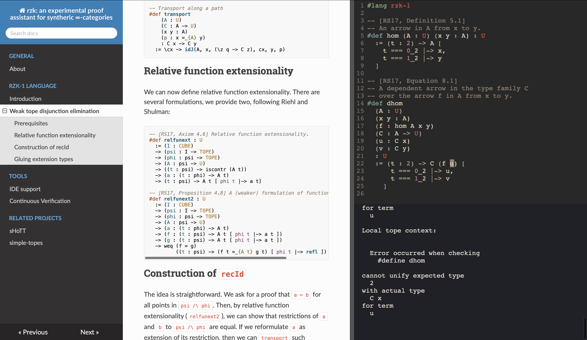

# rzk


[](https://fizruk.github.io/rzk/develop/)
[](https://fizruk.github.io/rzk/develop/haddock/index.html)
[](https://github.com/fizruk/rzk/actions/workflows/ghcjs.yml)

An experimental proof assistant for synthetic ∞-categories.

[](https://fizruk.github.io/rzk/develop/)

## About this project

This project has started with the idea of bringing Riehl and Shulman's 2017 paper [1] to "life" by implementing a proof assistant based on their type theory with shapes. Currently an early prototype with an [online playground](https://fizruk.github.io/rzk/develop/) is available. The current implementation is capable of checking various formalisations. Perhaps, the largest formalisations are available in two related projects: https://github.com/fizruk/sHoTT and https://github.com/emilyriehl/yoneda. `sHoTT` project (originally a fork of the yoneda project) aims to cover more formalisations in simplicial HoTT and ∞-categories, while `yoneda` project aims to compare different formalisations of the Yoneda lemma.

Internally, `rzk` uses a version of second-order abstract syntax allowing relatively straightforward handling of binders (such as lambda abstraction). In the future, `rzk` aims to support dependent type inference relying on E-unification for second-order abstract syntax [2].
Using such representation is motivated by automatic handling of binders and easily automated boilerplate code. The idea is that this should keep the implementation of `rzk` relatively small and less error-prone than some of the existing approaches to implementation of dependent type checkers.

An important part of `rzk` is a tope layer solver, which is essentially a theorem prover for a part of the type theory. A related project, dedicated just to that part is available at https://github.com/fizruk/simple-topes. `simple-topes` supports used-defined cubes, topes, and tope layer axioms. Once stable, `simple-topes` will be merged into `rzk`, expanding the proof assistant to the type theory with shapes, allowing formalisations for (variants of) cubical, globular, and other geometric versions of HoTT.

## How to use `rzk`

For relatively small single-file formalisations, you can use the online playground at https://fizruk.github.io/rzk/develop/playground.html

However, for larger and multi-file formalisations you should install a version of `rzk` locally:

- You can install the latest "stable" version of `rzk` from Hackage:
  ```sh
  cabal install rzk
  ```
  
- You can install the latest "development" version of `rzk` from the [`develop` branch](https://github.com/fizruk/rzk/tree/develop) of this repository:
  ```sh
  git clone https://github.com/fizruk/rzk.git
  cd rzk
  git checkout develop
  stack build && stack install
  ```
  
### VS Code

There exists a [VS Code extension for `rzk`](https://marketplace.visualstudio.com/items?itemName=NikolaiKudasovfizruk.rzk-1-experimental-highlighting) available on the Marketplace. The extension supports basic syntax highlighting, but more features may come in the future.

### Checking

To check a multi-file project, you need to call `rzk typecheck` specifying the files _in correct order_, e.g.:

```sh
rzk typecheck first.rzk second.rzk third.rzk
```

A proper support for inter-file dependencies will be implemented in the future. Until then, it is recommented to start names of files with a number, ensuring correct order when using a wildcard (`*`). For example:

```
.
├── 0-common.md
├── 1-paths.md
├── 2-contractible.md
├── 3-homotopies.md
├── 4-equivalences.md
├── 5-sigma.md
└── 6-trivial-fibrations.md

1 directory, 7 files
```

Inside of such directory, you can run `rzk typecheck` on all files using wildcards:

```sh
rzk typecheck *-*.md
```

## How to contribute to `rzk`

### Building the Documentation Locally

First, you need to install [MkDocs](https://www.mkdocs.org/getting-started/) and `mdx_math` Markdown extension (to enable LaTeX):

```sh
pip install python-markdown-math
```

Now, you can build and serve the documentation locally by running

```sh
mkdocs serve --config-file docs/mkdocs.yml
```

The (locally built) documentation should be available at http://127.0.0.1:8000

The pages of the documentation are the `*.md` files in [docs/docs](docs/docs) directory and its subdirectories.
To add a new page, you can create a new `*.md` file and add it to the navigation by modifying [docs/mkdocs.yml](docs/mkdocs.yml).

### Development

The project is developed with both Stack and Nix (for GHCJS version).

#### Building with GHC

For quick local development and testing it is recommended to work with a GHC version, using [Stack tool](https://docs.haskellstack.org/en/stable/README/). Clone this project and simply run `stack build`:

```sh
git clone git@github.com:fizruk/rzk.git
cd rzk
stack build
```

The build provides an executable `rzk` which can be used to typecheck files:

```haskell
stack exec -- rzk typecheck FILE
```

#### Building with GHCJS

`try-rzk` package is designed to be compiled using GHCJS for an in-browser version of the proof assistant. To build this package you need to use Nix. It is recommended that you use Cachix to avoid recompiling lots of dependencies:

```sh
# Install Nix
curl https://nixos.org/nix/install | sh
# (optionally) Install Cachix
nix-env -iA cachix -f https://cachix.org/api/v1/install
# (optionally) Use cached miso from Cachix
cachix use miso-haskell
```

Clone the repository, enter `try-rzk` directory and use `nix-build`:
```sh
git clone git@github.com:fizruk/rzk.git
cd rzk/try-rzk
nix-build
```

Now open `playground.html` to see the result. Note that if local GHCJS build is unavailable, `playground.html` will use the [JS file from GitHub Pages](https://fizruk.github.io/rzk/v0.1.0/result/bin/try-rzk.jsexe/all.js) as a fallback.

# References

1. Emily Riehl & Michael Shulman. A type theory for synthetic ∞-categories. Higher Structures 1(1), 147-224. 2017. https://arxiv.org/abs/1705.07442
2. Nikolai Kudasov. E-unification for Second-Order Abstract Syntax. 2023. https://arxiv.org/abs/2302.05815
 
