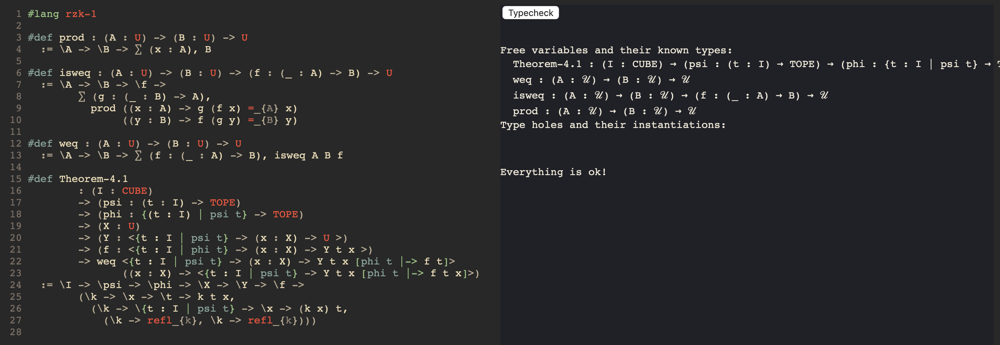

# rzk


[](https://github.com/fizruk/rzk/actions/workflows/ghcjs.yml)
[](https://fizruk.github.io/rzk/haddock/index.html)
[](https://fizruk.github.io/rzk/split.html)

[](https://fizruk.github.io/rzk/?lang=stlc)
[](https://fizruk.github.io/rzk/?lang=pcf)
[](https://fizruk.github.io/rzk/?lang=mltt)
[](https://fizruk.github.io/rzk/?lang=rzk-1)

Prototype interactive proof assistant based on a type theory for synthetic ∞-categories.

[](https://fizruk.github.io/rzk/?lang=rzk-1)

## Supported languages

The assistant is polylingual, supporting several language modes. The language mode is specified in the first line of the source module code:

```
#lang <mode>
```

Currently the online assistant supports the following `#lang` modes:

- `#lang rzk-1` ([try online](https://fizruk.github.io/rzk/?lang=rzk-1)) —
  the early prototype of the proof assistant based on Riehl and Shulman's type theory for synthetic ∞-categories.

- `#lang sltc` ([try online](https://fizruk.github.io/rzk/?lang=stlc)) —
  a variant of simply typed lambda calculus (STLC) with computation available at the level of types;

- `#lang pcf` ([try online](https://fizruk.github.io/rzk/?lang=pcf)) —
  programming with computable functions (PCF), an extension of simply typed lambda calculus with natural numbers and booleans;

- `#lang mltt` ([try online](https://fizruk.github.io/rzk/?lang=mltt)) —
  Martin-Löf Type Theory, a dependent type theory with [intensional identity types](https://ncatlab.org/nlab/show/identity+type).

## About this project

This project has started with the idea of bringing the ideas of Riehl and Shulman's 2017 paper [1] to life by implementing a proof assistant based on their type theory with shapes.
An early prototype has been implemented and is available as an executable `rzk` and also online at https://fizruk.github.io/rzk/?lang=rzk-1 .
The prototype is able to prove some of the important theorems about extension types from Section 4 of the original paper.

However, the initial implementation proved fragile and not particularly trustworthy, so I have decided to give it another go. Inspired by `unification-fd` and my previous experience with free monads I have decided to try more generic tools like free monads and intrinsically well-scoped terms a la Ross and Patterson [2] via `bound` package. It turned out that combining free monads with scopes is not particularly trivial.

Still, after some time I've managed to port over [Daniel Gratzner's version](https://github.com/jozefg/higher-order-unification) of higher-order unification algorithm (an untyped variation of Huet's algorithm). This approach to unification is avaialble in `Rzk.Free.Syntax.FreeScoped.Unification2` and is currently used by example implementations:
- untyped lambda calculus (see `Rzk.Free.Syntax.Example.ULC`),
- simply typed lambda calculus, with computation allowed at the level of types ([try online](https://fizruk.github.io/rzk/?lang=stlc)),
- programming with computable functions ([try online](https://fizruk.github.io/rzk/?lang=pcf)),
- Martin-Löf Type Theory ([try online](https://fizruk.github.io/rzk/?lang=mltt))

The second implementation did not quite get to Riehl and Shulman's type theory with shapes, as there were a couple of issues bothering me. First, this implementation relied on the fact that the language has lambda abstractions and applications, but only of one kind was accounted for in the unification algorithm. Riehl and Shulman's type theory technically has two different abstractions and applications (even though they reuse the same syntax in the paper for both) — for Π-types and for extensions types. Second, the handling of bound variables in Gratzner's implementation was incomplete, and it worsened with instinsic scopes in my code. When I tried to handle them properly in my code I has to resort to unsafe and awkward conversions. Those were quite tricky to debug.

Also, for Riehl and Shulman's type theory I would also need to account for tope constraints and known definitional equalities. And, as it is a three-layer type theory, perhaps, there is also a way to make those layers explicit and modular in the implementation.

So the third attempt, available in `Rzk.Free.Syntax.FreeScoped.ScopedUnification`, is similar to the second one, but is now more general and fixes the issue with bound variables. It relies on Sweirstra's idea of data types a la carte [3] and extends a given language with meta variables and applications of meta variables, rather than assuming the target language has lambdas or applications. This approach should work well for simple tuples and Σ-types as well as different kinds of lambda abstractions in a type theory. Here we also handle bound variables and constraints with more precision. The approach has been tested with untyped lambda calculus, but should be easily extended to other languages up to MLTT soon.

## Development

The project is developed with both Stack and Nix (for GHCJS version).

### Building with GHC

For quick local development and testing it is recommended to work with a GHC version, using [Stack tool](https://docs.haskellstack.org/en/stable/README/). Clone this project and simply run `stack build`:

```sh
git clone git@github.com:fizruk/rzk.git
cd rzk
stack build
```

The build provides an executable `rzk` which can be used to typecheck files:

```haskell
stack exec -- rzk typecheck FILE
```

### Building with GHCJS

`try-rzk` package is designed to be compiled using GHCJS for an in-browser version of the proof assistant. To build this package you need to use Nix. It is recommended that you use Cachix to avoid recompiling lots of dependencies:

```sh
# Install Nix
curl https://nixos.org/nix/install | sh
# (optionally) Install Cachix
nix-env -iA cachix -f https://cachix.org/api/v1/install
# (optionally) Use cached miso from Cachix
cachix use miso-haskell
```

Clone the repository, enter `try-rzk` directory and use `nix-build`:
```sh
git clone git@github.com:fizruk/rzk.git
cd rzk/try-rzk
nix-build
```

Now open `index.html` to see the result. Note that if local GHCJS build is unavailable, `index.html` will use the [JS file from GitHub Pages](https://fizruk.github.io/rzk/result/bin/try-rzk.jsexe/all.js) as a fallback.

# References

1. Emily Riehl, & Michael Shulman. (2017). A type theory for synthetic ∞-categories. https://arxiv.org/abs/1705.07442
2. Bird, Richard & Paterson, Ross. (2000). De Bruijn notation as a nested datatype. Journal of Functional Programming. Vol 9. 10.1017/S0956796899003366. 
3. SWIERSTRA, W. (2008). Data types à la carte. Journal of Functional Programming, 18(4), 423-436. doi:10.1017/S0956796808006758
