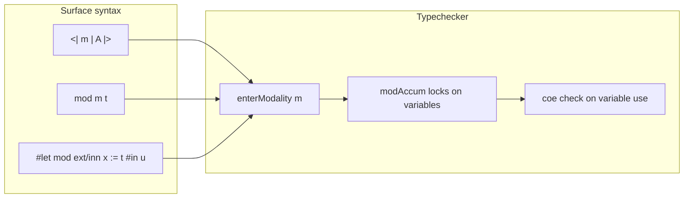

# Modalities (experimental)

```rzk
#lang rzk-1
```

Rzk’s **modal extension** supports reasoning in the style of **Triangulated Type Theory** (TTT), introduced by Gratzer, Weinberger, and Buchholtz[^ttt] as an enrichment of simplicial type theory with modalities \(\flat\), \(\sharp\), and \(op\). The extension is implemented on branch `lishy2-modal` by Islam Talipov[^taplipov-thesis], using a **parameterized mode theory** (composition and coercion of modes) layered on top of Rzk’s existing cube, tope, and type layers.

Formalizations that use this syntax include the [sHoTT `diruniv` branch](https://github.com/LIshy2/sHoTT/tree/diruniv), in particular [modal API examples](https://github.com/LIshy2/sHoTT/blob/diruniv/src/simplicial-hott/15-modalities.rzk) and a development of directed univalence ([`17-diruniv.rzk`](https://github.com/LIshy2/sHoTT/blob/diruniv/src/simplicial-hott/17-diruniv.rzk)).

!!! warning "Experimental"
    Modalities are not yet on the main `develop` branch or in published Rzk releases. Build Rzk from `lishy2-modal` to typecheck examples on this page.

## Modalities in Rzk

| Syntax | Typical reading (TTT) | Internal name |
|--------|----------------------|---------------|
| `#!rzk _b` | \(\flat\) (crisp / “bunch”) | `Flat` |
| `#!rzk _#` | \(\sharp\) | `Sharp` |
| `#!rzk _op` | \(op\) | `Op` |
| `#!rzk _id` | identity mode | `Id` |
| `#!rzk m₁/m₂` | composite mode | `comp m₁ m₂` |

Modes compose according to a fixed mode theory (for example, `#!rzk _op/_op` reduces to `#!rzk _id`). Not every pair of modes coerces into one another; the typechecker tracks which variables are accessible under the current modal context.

## Modal types and introduction

A type in modality `#!rzk m` is written `#!rzk <| m | A |>`. A term of that type is introduced with `#!rzk mod m t`, where `#!rzk t` is checked in a context “under” modality `#!rzk m`:

```rzk
#def sharp-pure (A : U) (x : A)
  : <| _# | A |>
  := mod _# x

#def sharp-map (A B : U) (f : A → B)
  : <| _# | A |> → <| _# | B |>
  :=
  \ (x : _# A) → mod _# (f x)
```

To use a crisp hypothesis, annotate the domain with `#!rzk _b` (compare `#!rzk b-extract` and `#!rzk b-map` below).

## Modal function types

Modal assumptions are written on ordinary function arrows: `#!rzk (x : m A) → B`, not as a separate arrow form. For example, a function that maps crisp elements of `#!rzk A` into `#!rzk B` has type `#!rzk _b A → B`, and a map between modal types uses `#!rzk (x : m A) → …` together with `#!rzk mod m`:

```rzk
#def b-extract (A : _b U) (x : _b A)
  : A
  := x

#def b-map (A B : _b U) (f : _b A → B)
  : <| _b | A |> → <| _b | B |>
  :=
  \ (x : _b A) → mod _b (f x)

#def b-dup (A : _b U) (x : _b A)
  : <| _b | <| _b | A |> |>
  :=
  mod _b (mod _b x)

#def op-map (A B : _op U) (f : _op A → B)
  : <| _op | A |> → <| _op | B |>
  :=
  \ (x : _op A) → mod _op (f x)
```

## Modal `#!rzk #let`

Modal bindings use `#!rzk #let mod ext/inn … #in`, where:

- `#!rzk ext` is the modality used when **checking** the right-hand side;
- `#!rzk inn` is the modality of the **bound** type `#!rzk <| inn | … |>`;
- the body is checked under the composite modality `#!rzk ext/inn`.

You can pattern-match on `#!rzk mod` in the binder, as in `#!rzk double-op`:

```rzk
#def double-op (A : U) (x : <| _op | <| _op | A |> |>)
  : A
  :=
  #let mod _op x_1 := x #in
  #let mod _op / _op x_2 := x_1 #in
  x_2

#def sharp-join (A : U) (a : <| _# | <| _# | A |> |>)
  : <| _# | A |>
  :=
  #let mod _# x_1 := a #in
  #let mod _# / _# x_2 := x_1 #in
  mod _# x_2
```

## How the typechecker uses modes

When checking `#!rzk mod m t` or a subexpression under `#!rzk #let mod ext/inn …`, the typechecker **enters** modality `#!rzk m` (`enterModality`): every in-scope variable gets an accumulated **lock** (`modAccum`). A variable may only be used if coercion from its own modality to the current locks succeeds (`coe`); otherwise you may see an error of the form:

> unaccessible var with modality … under locks …

Modal types support η-expansion internally: a term of type `#!rzk <| m | A |>` can be expanded to an application `#!rzk mod m …` when the checker needs a canonical form.



## Axioms and larger formalizations

Many principles of TTT are not built into Rzk as primitive rules; they are introduced as `#postulate` in libraries. On the sHoTT `diruniv` branch, examples include crisp induction for `#!rzk _b` and axioms for the directed interval modality. The directed-univalence development in [`17-diruniv.rzk`](https://github.com/LIshy2/sHoTT/blob/diruniv/src/simplicial-hott/17-diruniv.rzk) is the reference corpus for how modal syntax is used at scale; this page does not reproduce that proof.

## Limitations

- **Branch-only:** requires Rzk built from `lishy2-modal`.
- **Modal dependent sums:** the parser accepts `#!rzk Σ (x : m A), B`, but the typechecker does not yet handle `TypeSigmaModal` (ordinary `#!rzk Σ` without a modality annotation is supported).
- **Internal extract:** `#!rzk $extract$` appears only in internal terms (η-expansion); it is not valid user syntax to write or typecheck.
- **Ordinary `#!rzk #let`:** non-modal `#!rzk #let x := t #in u` was added on the same branch; see test examples in the repository (`rzk/test/files/let-good.rzk`). It is not documented in detail here.

## Related reading

- [Gratzer, Weinberger & Buchholtz — *Directed univalence in simplicial homotopy type theory*](https://arxiv.org/abs/2407.09146) (TTT)
- [sHoTT `diruniv`](https://github.com/LIshy2/sHoTT/tree/diruniv) — formalizations using Rzk modalities
- [Introduction](introduction.rzk.md) — cube, tope, and type layers
- [Dependent types](type-layer.rzk.md) — functions, sums, and identity types without modalities

[^ttt]: Daniel Gratzer, Jonathan Weinberger, Ulrik Buchholtz. _Directed univalence in simplicial homotopy type theory._ arXiv:2407.09146, 2024 (revised 2026). <https://arxiv.org/abs/2407.09146>

[^taplipov-thesis]: Islam Talipov. Implementation of triangulated type theory in the Rzk proof assistant (Bachelor's thesis, Russian). Higher School of Economics, 2026.
