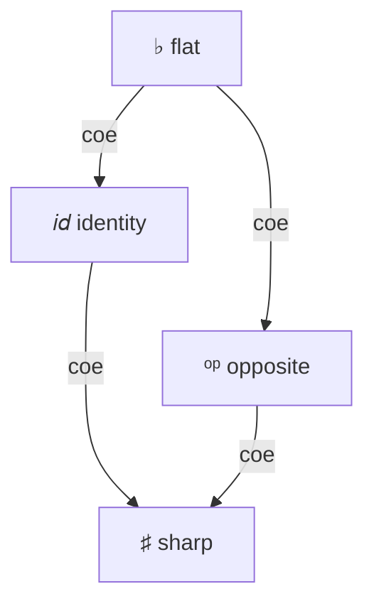

# Modalities (experimental)

```rzk
#lang rzk-1
```

Rzk's **modal extension** supports reasoning in the style of **Triangulated Type Theory** (TTT), introduced by Gratzer, Weinberger, and Buchholtz[^ttt] as an enrichment of simplicial type theory with modalities \(\flat\), \(\sharp\), and \(op\). The extension was implemented by Islam Talipov[^hottuf26], using a **parameterized mode theory** (composition and coercion of modes) layered on top of Rzk's existing cube, tope, and type layers. It ships with Rzk v0.8 and remains experimental.

Formalizations that use this syntax include the [sHoTT `diruniv` branch](https://github.com/LIshy2/sHoTT/tree/diruniv), in particular [modal API examples](https://github.com/LIshy2/sHoTT/blob/diruniv/src/simplicial-hott/15-modalities.rzk) and a development of directed univalence ([`17-diruniv.rzk`](https://github.com/LIshy2/sHoTT/blob/diruniv/src/simplicial-hott/17-diruniv.rzk)).

!!! warning "Experimental"
    Modalities are an experimental extension shipped in Rzk v0.8. The surface syntax and the mode theory may still change in future releases.

## Modalities in Rzk

Currently Rzk supports 3 modalities:

| Description | ASCII syntax | Unicode syntax |
|-------------|-------------|----------------|
| **Discretization** | `#!rzk _b` | `#!rzk ♭` |
| **Codiscretization** | `#!rzk _#` | `#!rzk ♯` |
| **Reverses orientation of arrows** | `#!rzk _op` | `#!rzk ᵒᵖ` |
| **Identity** | `#!rzk _id` | — |

Modalities compose according to a fixed mode theory (for example, `#!rzk _op/_op` reduces to `#!rzk _id`). Not every pair of modalities coerces into one another; the typechecker tracks which variables are accessible under the current modal context.

<div class="grid" markdown>
<div style="text-align:center;" markdown>



</div>
<div style="text-align:center;" markdown>

**♭ is idempotent and absorbing**

\({\flat} \cdot {\flat} = {\flat}\) &emsp; \({\flat} \cdot {\sharp} = {\flat}\)

\({op} \cdot {\flat} = {\flat}\) &emsp; \({\flat} \cdot {op} = {\flat}\)

**♯ is idempotent and absorbing**

\({\sharp} \cdot {\sharp} = {\sharp}\) &emsp; \({\sharp} \cdot {\flat} = {\sharp}\)

\({\sharp} \cdot {op} = {\sharp}\) &emsp; \({op} \cdot {\sharp} = {\sharp}\)

**op is involutive**

\({op} \cdot {op} = {id}\)

</div>
</div>


## Modal types and introduction

A type in modality `#!rzk µ` is written `#!rzk µ A`, where `#!rzk A` is checked under `#!rzk µ`. A term of that type is introduced with `#!rzk mod µ t`, where `#!rzk t` is checked in a context "under" modality `#!rzk µ`:

```rzk
#def sharp-pure₁ (A : U) (x : A)
  : ♯ A
  := mod ♯ x
```

This works for `#!rzk _#` because there is a coercion `#!rzk id → _#`, so any variable accessible under `#!rzk id` (i.e. any ordinary variable) is also accessible under `#!rzk _#`. For `#!rzk _b` there is no such coercion, so the analogous definition is ill-typed:

```{.unchecked .rzk}
-- ill-typed
#def bad-flat-pure (A : U) (x : A)
  : _b A
  := mod _b x
```

## Modal `#!rzk let mod`

Modal `#!rzk let mod` is the elimination principle for modal types.
Modal bindings use `#!rzk let mod ext/inn x := value in body`, where:

- `#!rzk value` is checked against `#!rzk inn T` under an **`ext`-lock**
- `#!rzk body` is checked with `#!rzk x` \(:^{ext \cdot inn}\) `#!rzk T` in context

If `#!rzk ext` is omitted, `#!rzk let mod m x := value in body` is sugar for `#!rzk let mod _id/m x := value in body`.

It can be seen as a pattern-match on `#!rzk mod` in the binder. For example, `#!rzk double-op` uses `#!rzk let mod` to define the modal composition \(\langle \text{op} | \langle \text{op} | A \rangle \rangle \to A\), since \(\text{op} \cdot \text{op} = id\):

```rzk

#def double-op (A : U) (x : ᵒᵖ (ᵒᵖ A))
  : A
  :=
  let mod ᵒᵖ x_1 := x in
  let mod ᵒᵖ / ᵒᵖ x_2 := x_1 in
  x_2

```
## Modal bindings

Modal parameter annotations `#!rzk (x :µ A)` bind the variable `#!rzk x` directly under modality `#!rzk µ` with type `#!rzk A`. This is a first-class modal binding — the variable `#!rzk x` is accessible according to the coercion rules of `#!rzk µ`. Modal bindings are available in `#!rzk λ`-abstractions, `#!rzk Π`- and `#!rzk Σ`-types, and definition argument lists.

For example, `#!rzk b-extract` and `#!rzk b-map` written with modal bindings are much cleaner than the explicit `#!rzk let mod` version shown above:

```rzk
#def b-extract₁ (A :♭ U) (x :♭ A)
  : A
  := x

#def b-map₁ (A B :♭ U) (f :♭ A → B)
  : ♭ A → ♭ B
  :=
  \ (x : ♭ A) → let mod ♭ bx := x in mod ♭ (f bx)

```

## S4-like combinators

Below is a small self-contained example of modal syntax. The combinators follow the S4-style structure: each modality comes with extract/map/join operations where the mode theory allows it. Note that `#!rzk ♭` carries a **comonadic** structure (`b-extract`, `b-map`, `b-dup`), while `#!rzk ♯` carries a **monadic** structure (`sharp-pure`, `sharp-map`, `sharp-join`).

```rzk
#def b-extract (A :♭ U) (x :♭ A)
  : A
  := x

#def b-map (A B :♭ U) (f :♭ A → B)
  : ♭ A → ♭ B
  := \ (x : ♭ A) → let mod ♭ bx := x in mod ♭ (f bx)

#def b-dup (A :♭ U) (x :♭ A)
  : ♭ ( ♭ A)
  := mod ♭ (mod ♭ x)

#def op-map (A B :ᵒᵖ U) (f :ᵒᵖ A → B)
  : ᵒᵖ A → ᵒᵖ B
  := \ (x : ᵒᵖ A) → let mod ᵒᵖ opx := x in mod ᵒᵖ (f opx)

#def sharp-pure (A : U) (x : A)
  : ♯ A
  := mod ♯ x

#def sharp-map (A B : U) (f : A → B)
  : ♯ A → ♯ B
  := \ (x : ♯ A) → let mod ♯ sx := x in mod ♯ (f sx)

#def sharp-join (A : U) (a : ♯ (♯ A))
  : ♯ A
  :=
  let mod ♯ x_1 := a in
  let mod ♯ / ♯ x_2 := x_1 in
  mod ♯ x_2
```

## How the typechecker uses modalities

Modalities not only introduce modal types but also impose constraints on how variables can be introduced and used.

- Every `#!rzk mod m …` or `#!rzk m A` expression places an **m-lock** (a lock annotated with modality \(m\)) on the current context.
- `#!rzk let mod ext/inn x := value in body` introduces `#!rzk x` as a **modality-parametrized binding** with modality \(ext \cdot inn\).
- A variable bound under modality \(\mu\) can only be used when the **accumulated lock** \(\hat{m}\) — the composition of all m-locks placed between the binding site and the use site — is \(\mu\)-coercible, i.e. there exists a coercion from \(\mu\) to \(\hat{m}\).

If a variable's modality cannot be coerced into the current lock accumulator, the typechecker reports:

> unaccessible var with modality … under locks …

## Modalities at tope level

### Inversion of arrows with op

Modalities are also available at the cube and tope layers. Their mechanics are the same as for modal types at the dependent type layer. Additionally, there are operators for inverting cubes and topes.

The equivalence between `#!rzk 2` and `#!rzk _op 2` is witnessed by `#!rzk flipᵒᵖ` and `#!rzk unflipᵒᵖ`. In particular, `#!rzk flipᵒᵖ 0₂` reduces to `#!rzk mod _op 1₂` and vice versa.

The equivalence between `#!rzk TOPE` and `#!rzk _op TOPE` is witnessed by `#!rzk invᵒᵖ` and `#!rzk uninvᵒᵖ`, which reverse the direction of inequalities.

Here is an example of a function that reverses the direction of a morphism using the `#!rzk _op` modality:

```
#def op-hom-to-hom
  ( B :_op U)
  ( x :_op B)
  ( y :_op B)
  ( h :_op (t : 2) → B [ t ≡ 0₂ ↦ x , t ≡ 1₂ ↦ y ])
  : ( ( t : 2) → _op B [ t ≡ 0₂ ↦ mod _op y , t ≡ 1₂ ↦ mod _op x ])
  := \ t → let mod _op s := flipᵒᵖ t in mod _op (h s)
```

### Discrete interval elimination

The discrete interval `#!rzk _b 2` can be treated as a Boolean type. A crisp point of `#!rzk 2` is either `#!rzk 0₂` or `#!rzk 1₂`, so we can eliminate by cases:

```
#def discrete-2-elim (i :_b 2) (A : U) (x y : A) : A :=
  recOR(
    (i === 0_2) |-> x,
    (i === 1_2) |-> y)
```

## Known unsoundness footgun: don't postulate `√` on `2`

!!! danger "Do not postulate `√` ("`2` is tiny") on the cube `2`"
    When formalizing Triangulated Type Theory[^ttt], the natural-looking next step after introducing modalities is to postulate the **amazing right adjoint** `√` to the path-space functor `(2 → −)` — equivalently, the assertion that the directed interval `2` is **tiny**. **This is unsound on the standard RS17 model.**

    The reason is structural. In the standard simplicial-set model `PSh(∆)`, the directed interval is realized by the representable `y([1])`, and **`(−)^I` has no right adjoint** — concretely, exponentiation by `y([1])` does not preserve pushouts (see [Gratzer–Weinberger–Buchholtz §1.3 and §3](https://arxiv.org/abs/2407.09146), footnote 7). Rzk's cube `2` inherits exactly that totally-ordered structure, so postulating `√` on `2` — or any `is-tiny(2)` formulation — contradicts the model.

    The planned **`𝕀`** primitive — a bounded distributive lattice cube, per GWB §1.3 — is the **sound place** to postulate `√`. Until `𝕀` ships, TT⊲ formalizations with `√`-on-`2` can potentially be unsound (if the underlying tope solver ever relies on the total order).

## Axioms and larger formalizations

Many principles of TTT are not built into Rzk as primitive rules; they are introduced as `#postulate` in libraries. On the sHoTT `diruniv` branch, examples include crisp induction for `#!rzk _b` and axioms for the directed interval modality. The directed-univalence development in [`17-diruniv.rzk`](https://github.com/LIshy2/sHoTT/blob/diruniv/src/simplicial-hott/17-diruniv.rzk) is the reference corpus for how modal syntax is used at scale; this page does not reproduce that proof.

## Related reading

- [Gratzer, Weinberger & Buchholtz — *Directed univalence in simplicial homotopy type theory*](https://arxiv.org/abs/2407.09146) (TTT)
- [Talipov & Kudasov — *Towards Formalization of Directed Univalence in Rzk proof assistant*](https://hott-uf.github.io/2026/abstracts/HoTTUF_2026_paper_22.pdf) — HoTT/UF 2026 contributed talk on this extension
- [sHoTT `diruniv`](https://github.com/LIshy2/sHoTT/tree/diruniv) — formalizations using Rzk modalities
- [Introduction](introduction.rzk.md) — cube, tope, and type layers
- [Dependent types](type-layer.rzk.md) — functions, sums, and identity types without modalities

[^ttt]: Daniel Gratzer, Jonathan Weinberger, Ulrik Buchholtz. _Directed univalence in simplicial homotopy type theory._ arXiv:2407.09146, 2024 (revised 2026). <https://arxiv.org/abs/2407.09146>

[^hottuf26]: Islam Talipov and Nikolai Kudasov. _Towards Formalization of Directed Univalence in Rzk proof assistant._ Contributed talk, HoTT/UF 2026. <https://hott-uf.github.io/2026/abstracts/HoTTUF_2026_paper_22.pdf>
