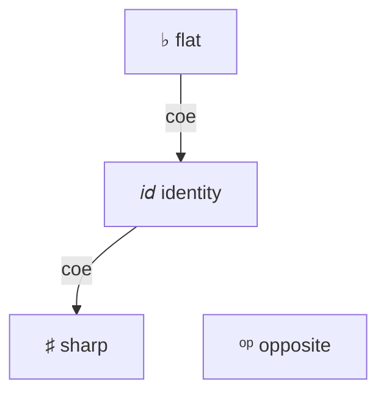

# Modalities (experimental)

```rzk
#lang rzk-1
```

Rzk’s **modal extension** supports reasoning in the style of **Triangulated Type Theory** (TTT), introduced by Gratzer, Weinberger, and Buchholtz[^ttt] as an enrichment of simplicial type theory with modalities \(\flat\), \(\sharp\), and \(op\). The extension is implemented on branch `lishy2-modal` by Islam Talipov, using a **parameterized mode theory** (composition and coercion of modes) layered on top of Rzk’s existing cube, tope, and type layers.

Formalizations that use this syntax include the [sHoTT `diruniv` branch](https://github.com/LIshy2/sHoTT/tree/diruniv), in particular [modal API examples](https://github.com/LIshy2/sHoTT/blob/diruniv/src/simplicial-hott/15-modalities.rzk) and a development of directed univalence ([`17-diruniv.rzk`](https://github.com/LIshy2/sHoTT/blob/diruniv/src/simplicial-hott/17-diruniv.rzk)).

!!! warning "Experimental"
    Modalities are not yet on the main `develop` branch or in published Rzk releases. Build Rzk from `lishy2-modal` to typecheck examples on this page.

## Modalities in Rzk

Currently Rzk supports 3 modalities:

| Description | ASCII syntax | Unicode syntax |
|-------------|-------------|----------------|
| **Discretization** | `#!rzk _b` | `#!rzk ♭` |
| **Codiscretization** | `#!rzk _#` | `#!rzk ♯` |
| **Reverses orientation of arrows** | `#!rzk _op` | `#!rzk ᵒᵖ` |
| **Identity** | `#!rzk _id` | — |

Modalities compose according to a fixed mode theory (for example, `#!rzk _op/_op` reduces to `#!rzk _id`). Not every pair of modalities coerces into one another; the typechecker tracks which variables are accessible under the current modal context.

<div class="grid" markdown>
<div style="text-align:center;" markdown>



</div>
<div style="text-align:center;" markdown>

**♭ is idempotent and absorbing**

\({\flat} \cdot {\flat} = {\flat}\) &emsp; \({\flat} \cdot {\sharp} = {\flat}\)

\({op} \cdot {\flat} = {\flat}\) &emsp; \({\flat} \cdot {op} = {\flat}\)

**♯ is idempotent and absorbing**

\({\sharp} \cdot {\sharp} = {\sharp}\) &emsp; \({\sharp} \cdot {\flat} = {\sharp}\)

\({\sharp} \cdot {op} = {\sharp}\) &emsp; \({op} \cdot {\sharp} = {\sharp}\)

**op is involutive**

\({op} \cdot {op} = {id}\)

</div>
</div>


## Modal types and introduction

A type in modality `#!rzk µ` is written `#!rzk <| µ | A |>`, where `#!rzk A` is checked under `#!rzk µ`. A term of that type is introduced with `#!rzk mod µ t`, where `#!rzk t` is checked in a context “under” modality `#!rzk µ`:

```rzk
#def sharp-pure (A : U) (x : A)
  : <| _# | A |>
  := mod _# x

```

This works for `#!rzk _#` because there is a coercion `#!rzk id → _#`, so any variable accessible under `#!rzk id` (i.e. any ordinary variable) is also accessible under `#!rzk _#`. For `#!rzk _b` there is no such coercion, so the analogous definition is ill-typed:

```{.rzk .unchecked}
-- ill-typed
#def bad-flat-pure (A : U) (x : A)
  : <| _b | A |>
  := mod _b x

## Modal `#!rzk let mod`

Modal `#!rzk let mod` is the elimination principle for modal types.
Modal bindings use `#!rzk let mod ext/inn x := value in body`, where:

- `#!rzk ext` is the modality used when **checking** `#!rzk value`
- `#!rzk inn` is the modality of the **bound** type `#!rzk <| inn | T |>`, which is the type of `#!rzk x`
- `#!rzk body` is checked with `#!rzk x` \(:^{ext \cdot inn}\) `#!rzk T` in context

If `#!rzk ext` is omitted, `#!rzk let mod m x := value in body` is sugar for `#!rzk let mod _id/m x := value in body`.

It can be seen as a pattern-match on `#!rzk mod` in the binder. For example, `#!rzk b-extract` is the opposite of `#!rzk sharp-pure` — it is definable precisely because there is a coercion \(\flat \Rightarrow id\):

```rzk

#def b-extract (A : <| _b | U |>) (x : let mod _b Ab := A in <| _b | Ab |>)
  : let mod _b Ab := A in Ab
  := let mod _b xb := x in xb

```

Using `#!rzk let mod` you can define the modal сomposition \(\langle \mu | \langle \nu | A \rangle \rangle \to \langle \mu \cdot \nu | A \rangle\). A concrete example is `#!rzk double-op`:

```rzk
#def double-op (A : U) (x : <| _op | <| _op | A |> |>)
  : A
  :=
  let mod _op x_1 := x in
  let mod _op / _op x_2 := x_1 in
  x_2

```
## Modal bindings

Modal parameter annotations `#!rzk (x : m A)` are syntactic sugar that makes definitions look less verbose than the raw `#!rzk let mod` form. A parameter `#!rzk (x : _b A) -> ...` desugars to `#!rzk (_a : <| _b | A |>) → let mod _b x := _a in …`. This sugar is available in `#!rzk λ`-abstractions, `#!rzk Π`- and `#!rzk Σ`-types, and definition argument lists.

For example, `#!rzk b-extract` and `#!rzk b-map` written with modal bindings are much cleaner than the explicit `#!rzk let mod` version shown above:

```rzk
#def b-extract (A : _b U) (x : _b A)
  : A
  := x

#def b-map (A B : _b U) (f : _b A → B)
  : <| _b | A |> → <| _b | B |>
  :=
  \ (x : _b A) → mod _b (f x)

```

## S4-like combinators

Below is a small self-contained example of modal syntax. The combinators follow the S4-style structure: each modality comes with extract/map/join operations where the mode theory allows it. Note that `#!rzk ♭` carries a **comonadic** structure (`b-extract`, `b-map`, `b-dup`), while `#!rzk ♯` carries a **monadic** structure (`sharp-pure`, `sharp-map`, `sharp-join`).

```rzk
#def b-extract (A : _b U) (x : _b A) : A := x

#def b-map (A B : _b U) (f : _b A → B)
  : <| _b | A |> → <| _b | B |>
  := \ (x : _b A) → mod _b (f x)

#def b-dup (A : _b U) (x : _b A)
  : <| _b | <| _b | A |> |>
  := mod _b (mod _b x)

#def op-map (A B : _op U) (f : _op A → B)
  : <| _op | A |> → <| _op | B |>
  := \ (x : _op A) → mod _op (f x)

#def sharp-pure (A : U) (x : A) : <| _# | A |> := mod _# x

#def sharp-map (A B : U) (f : A → B)
  : <| _# | A |> → <| _# | B |>
  := \ (x : _# A) → mod _# (f x)

#def sharp-join (A : U) (a : <| _# | <| _# | A |> |>)
  : <| _# | A |>
  :=
  let mod _# x_1 := a in
  let mod _# / _# x_2 := x_1 in
  mod _# x_2
```

## How the typechecker uses modalities

Modalities not only introduce modal types but also impose constraints on how variables can be introduced and used.

- Every `#!rzk mod m …` or `#!rzk <| m | … |>` expression places an **m-lock** (a lock annotated with modality \(m\)) on the current context.
- `#!rzk let mod ext/inn x := value in body` introduces `#!rzk x` as a **modality-parametrized binding** with modality \(ext \cdot inn\).
- A variable bound under modality \(\mu\) can only be used when the **accumulated lock** \(\hat{m}\) — the composition of all m-locks placed between the binding site and the use site — is \(\mu\)-coercible, i.e. there exists a coercion from \(\mu\) to \(\hat{m}\).

If a variable's modality cannot be coerced into the current lock accumulator, the typechecker reports:

> unaccessible var with modality … under locks …

## Modalities at tope level

### Inversion of arrows with op 

Modalities are also available at the cube and tope layers. Their mechanics are the same as for modal types at the dependent type layer. Additionally, there are operators for inverting cubes and topes.

The equivalence between `#!rzk 2` and `#!rzk <| _op | 2 |>` is witnessed by `#!rzk flipᵒᵖ` and `#!rzk unflipᵒᵖ`. In particular, `#!rzk flipᵒᵖ 0₂` reduces to `#!rzk mod _op 1₂` and vice versa.

The equivalence between `#!rzk TOPE` and `#!rzk <| _op | TOPE |>` is witnessed by `#!rzk invᵒᵖ` and `#!rzk uninvᵒᵖ`, which reverse the direction of inequalities.

Here is an example of a function that inverts a morphism using the `#!rzk _op` modality:

```
#def hom-to-op-hom
  ( B : _op U)
  ( x : _op B)
  ( y : _op B)
  ( h : _op (t : 2) → B [ t ≡ 0₂ ↦ x , t ≡ 1₂ ↦ y ])
  : ( ( t : 2) → <| _op | B |> [ t ≡ 0₂ ↦ mod _op y , t ≡ 1₂ ↦ mod _op x ])
  := \ t → let mod _op s := flipᵒᵖ t in mod _op (h s)
```

### Discrete interval elimination

The discrete interval `#!rzk <| _b | 2 |>` can be treated as a Boolean type. A crisp point of `#!rzk 2` is either `#!rzk 0₂` or `#!rzk 1₂`, so we can eliminate by cases:

```
#def discrete-2-elim (i : _b 2) (A : U) (x y : A) : A :=
  recOR(
    (i === 0_2) |-> x,
    (i === 1_2) |-> y)
```

## Axioms and larger formalizations

Many principles of TTT are not built into Rzk as primitive rules; they are introduced as `#postulate` in libraries. On the sHoTT `diruniv` branch, examples include crisp induction for `#!rzk _b` and axioms for the directed interval modality. The directed-univalence development in [`17-diruniv.rzk`](https://github.com/LIshy2/sHoTT/blob/diruniv/src/simplicial-hott/17-diruniv.rzk) is the reference corpus for how modal syntax is used at scale; this page does not reproduce that proof.

## Related reading

- [Gratzer, Weinberger & Buchholtz — *Directed univalence in simplicial homotopy type theory*](https://arxiv.org/abs/2407.09146) (TTT)
- [sHoTT `diruniv`](https://github.com/LIshy2/sHoTT/tree/diruniv) — formalizations using Rzk modalities
- [Introduction](introduction.rzk.md) — cube, tope, and type layers
- [Dependent types](type-layer.rzk.md) — functions, sums, and identity types without modalities

[^ttt]: Daniel Gratzer, Jonathan Weinberger, Ulrik Buchholtz. _Directed univalence in simplicial homotopy type theory._ arXiv:2407.09146, 2024 (revised 2026). <https://arxiv.org/abs/2407.09146>

