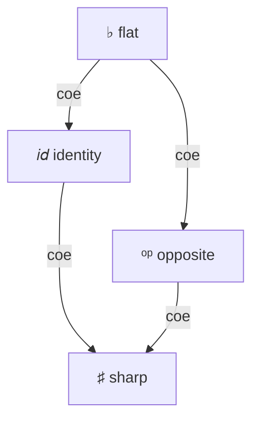

# Модальности (экспериментально)

```rzk
#lang rzk-1
```

**Модальное расширение** Rzk поддерживает рассуждения в стиле **Триангулированной теории типов** (TTT), введённой Гратцером, Вайнбергером и Бухгольцем[^ttt] как обогащение симплициальной теории типов модальностями \(\flat\), \(\sharp\) и \(op\). Расширение реализовано Исламом Талиповым[^hottuf26] с использованием **параметризованной теории режимов** (композиция и коэрсия режимов), надстроенной над существующими слоями кубов, топов и типов в Rzk. Оно входит в Rzk v0.8 и остаётся экспериментальным.

К формализациям, использующим этот синтаксис, относятся [ветка `diruniv` репозитория sHoTT](https://github.com/LIshy2/sHoTT/tree/diruniv), в частности [примеры модального API](https://github.com/LIshy2/sHoTT/blob/diruniv/src/simplicial-hott/15-modalities.rzk) и разработка направленной унивалентности ([`17-diruniv.rzk`](https://github.com/LIshy2/sHoTT/blob/diruniv/src/simplicial-hott/17-diruniv.rzk)).

!!! warning "Экспериментально"
    Модальности — это экспериментальное расширение, вошедшее в Rzk v0.8. Синтаксис и теория режимов могут измениться в будущих релизах.

## Модальности в Rzk

В настоящее время Rzk поддерживает 3 модальности:

| Описание | ASCII-синтаксис | Юникод-синтаксис |
|----------|-----------------|------------------|
| **Дискретизация** | `#!rzk _b` | `#!rzk ♭` |
| **Кодискретизация** | `#!rzk _#` | `#!rzk ♯` |
| **Обращение направления стрелок** | `#!rzk _op` | `#!rzk ᵒᵖ` |
| **Тождественная** | `#!rzk _id` | — |

Модальности компонуются согласно фиксированной теории режимов (например, `#!rzk _op/_op` редуцируется к `#!rzk _id`). Не каждая пара модальностей приводится друг к другу; решатель типов отслеживает, какие переменные доступны в текущем модальном контексте.

<div class="grid" markdown>
<div style="text-align:center;" markdown>



</div>
<div style="text-align:center;" markdown>

**♭ идемпотентна и поглощающая**

\({\flat} \cdot {\flat} = {\flat}\) &emsp; \({\flat} \cdot {\sharp} = {\flat}\)

\({op} \cdot {\flat} = {\flat}\) &emsp; \({\flat} \cdot {op} = {\flat}\)

**♯ идемпотентна и поглощающая**

\({\sharp} \cdot {\sharp} = {\sharp}\) &emsp; \({\sharp} \cdot {\flat} = {\sharp}\)

\({\sharp} \cdot {op} = {\sharp}\) &emsp; \({op} \cdot {\sharp} = {\sharp}\)

**op инволютивна**

\({op} \cdot {op} = {id}\)

</div>
</div>


## Модальные типы и введение

Тип в модальности `#!rzk µ` записывается как `#!rzk µ A`, где `#!rzk A` проверяется под `#!rzk µ`. Терм этого типа вводится через `#!rzk mod µ t`, где `#!rzk t` проверяется в контексте «под» модальностью `#!rzk µ`:

```rzk
#def sharp-pure₁ (A : U) (x : A)
  : ♯ A
  := mod ♯ x
```

Это работает для `#!rzk _#`, потому что есть коэрсия `#!rzk id → _#`, и любая переменная, доступная под `#!rzk id` (то есть любая обычная переменная), доступна и под `#!rzk _#`. Для `#!rzk _b` такой коэрсии нет, поэтому аналогичное определение некорректно типизировано:

```{.unchecked .rzk}
-- ошибка типизации
#def bad-flat-pure (A : U) (x : A)
  : _b A
  := mod _b x
```

## Модальный `#!rzk let mod`

Модальный `#!rzk let mod` — это принцип устранения для модальных типов.
Модальные привязки используют форму `#!rzk let mod ext/inn x := value in body`, где:

- `#!rzk value` проверяется на тип `#!rzk inn T` под **`ext`-замком**
- `#!rzk body` проверяется с `#!rzk x` \(:^{ext \cdot inn}\) `#!rzk T` в контексте

Если `#!rzk ext` опущен, то `#!rzk let mod m x := value in body` — это сахар для `#!rzk let mod _id/m x := value in body`.

Это можно рассматривать как сопоставление с образцом `#!rzk mod` в связке. Например, `#!rzk double-op` использует `#!rzk let mod` для определения модальной композиции \(\langle \text{op} | \langle \text{op} | A \rangle \rangle \to A\), поскольку \(\text{op} \cdot \text{op} = id\):

```rzk

#def double-op (A : U) (x : ᵒᵖ (ᵒᵖ A))
  : A
  :=
  let mod ᵒᵖ x_1 := x in
  let mod ᵒᵖ / ᵒᵖ x_2 := x_1 in
  x_2

```
## Модальные связки

Модальные аннотации параметров `#!rzk (x :µ A)` — это синтаксический сахар, делающий определения менее громоздкими по сравнению с сырой формой `#!rzk let mod`. Параметр `#!rzk (x :_b A) -> ...` десахаризуется в `#!rzk (_a : _b A) → let mod _b x := _a in …`. Этот сахар доступен в `#!rzk λ`-абстракциях, `#!rzk Π`- и `#!rzk Σ`-типах, а также в списках аргументов определений.

Например, `#!rzk b-extract` и `#!rzk b-map`, записанные с модальными связками, гораздо чище, чем явная форма `#!rzk let mod`, показанная выше:

```rzk
#def b-extract₁ (A :♭ U) (x :♭ A)
  : A
  := x

#def b-map₁ (A B :♭ U) (f :♭ A → B)
  : ♭ A → ♭ B
  :=
  \ (x : ♭ A) → let mod ♭ bx := x in mod ♭ (f bx)

```

## Комбинаторы в стиле S4

Ниже — небольшой самодостаточный пример модального синтаксиса. Комбинаторы следуют структуре в стиле S4: каждая модальность снабжена операциями extract/map/join там, где это допускает теория режимов. Обратите внимание, что `#!rzk ♭` несёт **комонадическую** структуру (`b-extract`, `b-map`, `b-dup`), тогда как `#!rzk ♯` несёт **монадическую** структуру (`sharp-pure`, `sharp-map`, `sharp-join`).

```rzk
#def b-extract (A :♭ U) (x :♭ A)
  : A
  := x

#def b-map (A B :♭ U) (f :♭ A → B)
  : ♭ A → ♭ B
  := \ (x : ♭ A) → let mod ♭ bx := x in mod ♭ (f bx)

#def b-dup (A :♭ U) (x :♭ A)
  : ♭ (♭ A)
  := mod ♭ (mod ♭ x)

#def op-map (A B :ᵒᵖ U) (f :ᵒᵖ A → B)
  : ᵒᵖ A → ᵒᵖ B
  := \ (x : ᵒᵖ A) → let mod ᵒᵖ opx := x in mod ᵒᵖ (f opx)

#def sharp-pure (A : U) (x : A)
  : ♯ A
  := mod ♯ x

#def sharp-map (A B : U) (f : A → B)
  : ♯ A → ♯ B
  := \ (x : ♯ A) → let mod ♯ sx := x in mod ♯ (f sx)

#def sharp-join (A : U) (a : ♯ (♯ A))
  : ♯ A
  :=
  let mod ♯ x_1 := a in
  let mod ♯ / ♯ x_2 := x_1 in
  mod ♯ x_2
```

## Как решатель типов использует модальности

Модальности не только вводят модальные типы, но и накладывают ограничения на то, как переменные можно вводить и использовать.

- Каждое выражение `#!rzk mod m …` или `#!rzk m A` ставит **m-замок** (замок, помеченный модальностью \(m\)) на текущий контекст.
- `#!rzk let mod ext/inn x := value in body` вводит `#!rzk x` как **связку, параметризованную модальностью** с модальностью \(ext \cdot inn\).
- Переменная, связанная под модальностью \(\mu\), может использоваться, только когда **накопленный замок** \(\hat{m}\) — композиция всех m-замков, поставленных между местом связывания и местом использования, — \(\mu\)-приводим, то есть существует коэрсия из \(\mu\) в \(\hat{m}\).

Если модальность переменной не приводима к текущему накопителю замков, решатель типов сообщает:

> unaccessible var with modality … under locks …

## Модальности на уровне топов

### Обращение стрелок с помощью op

Модальности также доступны на слоях кубов и топов. Их механика та же, что и у модальных типов на слое зависимых типов. Дополнительно есть операторы для обращения кубов и топов.

Эквивалентность между `#!rzk 2` и `#!rzk _op 2` свидетельствуется `#!rzk flipᵒᵖ` и `#!rzk unflipᵒᵖ`. В частности, `#!rzk flipᵒᵖ 0₂` редуцируется к `#!rzk mod _op 1₂` и наоборот.

Эквивалентность между `#!rzk TOPE` и `#!rzk _op TOPE` свидетельствуется `#!rzk invᵒᵖ` и `#!rzk uninvᵒᵖ`, которые обращают направление неравенств.

Вот пример функции, обращающей направление морфизма с помощью модальности `#!rzk _op`:

```
#def op-hom-to-hom
  ( B :_op U)
  ( x :_op B)
  ( y :_op B)
  ( h :_op (t : 2) → B [ t ≡ 0₂ ↦ x , t ≡ 1₂ ↦ y ])
  : ( ( t : 2) → _op B [ t ≡ 0₂ ↦ mod _op y , t ≡ 1₂ ↦ mod _op x ])
  := \ t → let mod _op s := flipᵒᵖ t in mod _op (h s)
```

### Устранение дискретного интервала

Дискретный интервал `#!rzk _b 2` можно трактовать как булев тип. Чёткая точка типа `#!rzk 2` — это либо `#!rzk 0₂`, либо `#!rzk 1₂`, поэтому возможен разбор случаев:

```
#def discrete-2-elim (i :_b 2) (A : U) (x y : A) : A :=
  recOR(
    (i === 0_2) |-> x,
    (i === 1_2) |-> y)
```

## Известная ловушка некорректности: не постулируйте `√` на `2`

!!! danger "Не постулируйте `√` ("`2` крошечный") на кубе `2`"
    При формализации Триангулированной теории типов[^ttt] естественно напрашивающимся следующим шагом после введения модальностей выглядит постулирование **удивительной правой сопряжённой** `√` к функтору пространства путей `(2 → −)` — что эквивалентно утверждению, что направленный интервал `2` является **крошечным** (tiny). **Это некорректно на стандартной модели RS17.**

    Причина структурная. В стандартной модели симплициальных множеств `PSh(∆)` направленный интервал реализуется представимым `y([1])`, и у функтора `(−)^I` **нет правой сопряжённой** — конкретное препятствие в том, что возведение в степень `y([1])` не сохраняет [кодекартовы квадраты](https://ru.wikipedia.org/wiki/Кодекартов_квадрат) (см. [Гратцер–Вайнбергер–Бухгольц §1.3 и §3](https://arxiv.org/abs/2407.09146), сноска 7). Куб `2` в Rzk наследует ровно эту линейно упорядоченную структуру, поэтому постулирование `√` на `2` — или любой формулировки `is-tiny(2)` — противоречит модели.

    Планируемый примитив **`𝕀`** — куб-ограниченная дистрибутивная решётка, согласно GWB §1.3, — будет **корректным местом** для постулирования `√`. Пока `𝕀` не реализован, формализации TT⊲ с `√`-на-`2` потенциально могут быть некорректными (если используемый решатель топов когда-либо начнёт опираться на линейный порядок).

## Аксиомы и крупные формализации

Многие принципы TTT не встроены в Rzk как первичные правила; они вводятся через `#postulate` в библиотеках. В ветке `diruniv` репозитория sHoTT примеры включают чёткую индукцию для `#!rzk _b` и аксиомы для модальности направленного интервала. Разработка направленной унивалентности в [`17-diruniv.rzk`](https://github.com/LIshy2/sHoTT/blob/diruniv/src/simplicial-hott/17-diruniv.rzk) — это эталонный корпус того, как модальный синтаксис используется в полном масштабе; эта страница не воспроизводит то доказательство.

## Дополнительное чтение

- [Гратцер, Вайнбергер и Бухгольц — *Directed univalence in simplicial homotopy type theory*](https://arxiv.org/abs/2407.09146) (TTT)
- [Талипов и Кудасов — *Towards Formalization of Directed Univalence in Rzk proof assistant*](https://hott-uf.github.io/2026/abstracts/HoTTUF_2026_paper_22.pdf) — представленный доклад на HoTT/UF 2026 по этому расширению
- [sHoTT `diruniv`](https://github.com/LIshy2/sHoTT/tree/diruniv) — формализации, использующие модальности Rzk
- [Введение](introduction.rzk.md) — слои кубов, топов и типов
- [Зависимые типы](type-layer.rzk.md) — функции, суммы и типы тождеств без модальностей

[^ttt]: Daniel Gratzer, Jonathan Weinberger, Ulrik Buchholtz. _Directed univalence in simplicial homotopy type theory._ arXiv:2407.09146, 2024 (исправл. 2026). <https://arxiv.org/abs/2407.09146>

[^hottuf26]: Islam Talipov, Nikolai Kudasov. _Towards Formalization of Directed Univalence in Rzk proof assistant._ Представленный доклад, HoTT/UF 2026. <https://hott-uf.github.io/2026/abstracts/HoTTUF_2026_paper_22.pdf>

