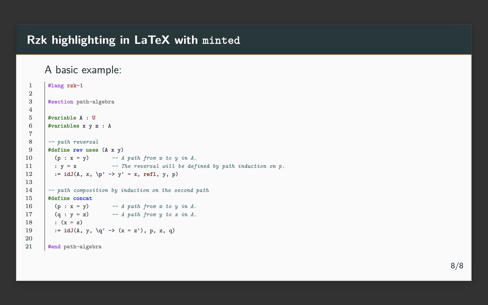

# Pygments higlighter for Rzk

This is a simple [Pygments](https://pygments.org) higlighter for Rzk, which can be used with [`minted` package](https://www.ctan.org/pkg/minted) when writing rzk code in LaTeX.

## How to use

### Install

Clone this repository, and install the highlighter using [`pip` installer](https://pip.pypa.io/en/stable/):

```sh
git clone https://github.com/fizruk/rzk.git
cd rzk            # enter repository root
cd rzk/RzkLexer   # enter the directory with RzkLexer
pip install .     # install using pip
```

### Use in LaTeX

In your LaTeX document:

1. Include `minted` package:

```tex
\package{minted}
```

2. Use `minted` environment with `rzk` language, for example:

```tex
\begin{frame}[fragile]
  \frametitle{\textsc{Rzk} highlighting in LaTeX with \texttt{minted}}

A basic example:

\tiny
\begin{minted}[linenos,frame=leftline,mathescape]{rzk}
#lang rzk-1

#section path-algebra

#variable A : U
#variables x y z : A

-- path reversal
#define rev uses (A x y)
  (p : x = y)       -- A path from x to y in A.
  : y = x           -- The reversal will be defined by path induction on p.
  := idJ(A, x, \y' p' -> y' = x, refl, y, p)

-- path composition by induction on the second path
#define concat 
  (p : x = y)       -- A path from x to y in A.
  (q : y = z)       -- A path from y to z in A.
  : (x = z)
  := idJ(A, y, \z' q' -> (x = z'), p, z, q)

#end path-algebra
\end{minted}

\end{frame}
```

